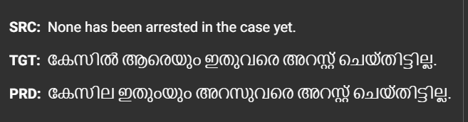
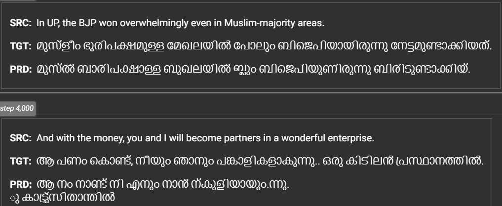
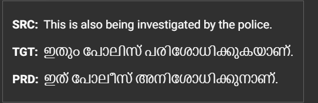
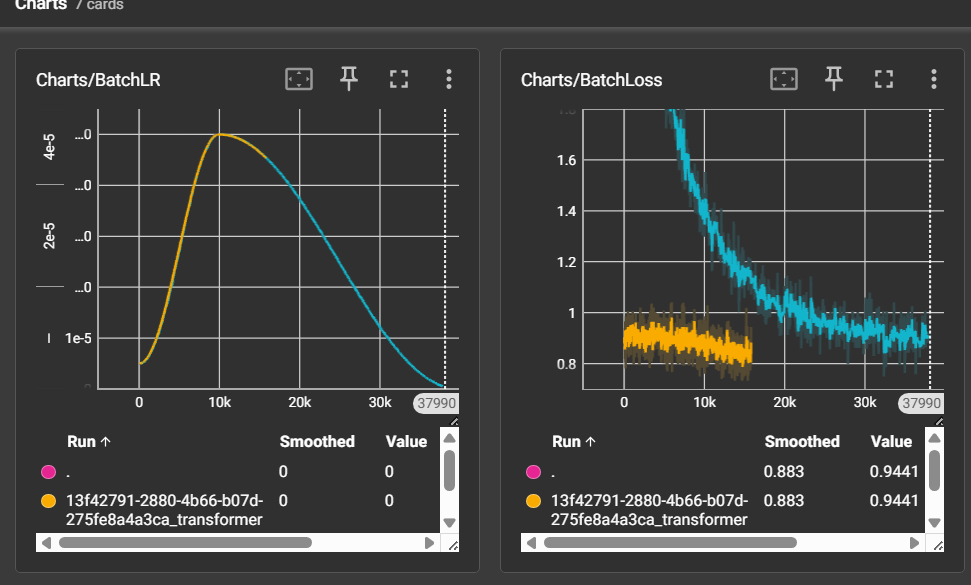

# Attention is all I need


## Project Overview

This repository is a personal learning project to build a transformer-based English-to-Malayalam translation model from scratch. The goal is to understand the transformer architecture end-to-end, including tokenization, model design, training, and inference.

The codebase is intentionally minimal and handcrafted. It is not a production-level system, but it is a working proof-of-concept transformer implementation that covers the core building blocks of encoder-decoder translation.

## Model Details

The model is configured in `src/config.py`. Key settings include:

- `NUM_LAYERS = 12` encoder/decoder layers
- `HEAD_COUNT = 16` attention heads
- `EMBEDDING_SIZE = 512`
- `DFF = 2048` feed-forward hidden size
- `SRC_VOCAB_SIZE = 9000` and `TGT_VOCAB_SIZE = 9000`
- `MAX_SEQ_LEN = 66`
- `DROPOUT = 0.1`
- `LEARNING_RATE = 5e-5` with Adam optimizer and OneCycleLR scheduler

The transformer implementation is located under `src/transformer/`, with separate encoder, decoder, multi-head attention, and position-wise feed-forward components.

## Training Guide

### Clone and prepare the repository

1. Clone the repository:
   ```bash
   git clone https://github.com/ivanrj7j/AttentionIsAllINeed.git
   cd AttentionIsAllINeed
   ```
2. Install dependencies from `requirements.txt`.
3. Prepare the dataset files in `dataset/`:
   - `engTrain.txt`, `malTrain.txt`
   - `engVal.txt`, `malVal.txt`
   - `engTest.txt`, `malTest.txt`
4. Configure tokenizer and file paths in `src/config.py` if needed.
5. Run training from `src/main.py`.
6. The training loop uses mixed precision with `torch.amp`, gradient clipping, and periodic checkpoint saves.
7. Validation is performed using a subset of the validation loader and sample outputs are logged to TensorBoard.

### Notes from `src/train.ipynb`

The notebook documents a Kaggle-style training setup. It shows how to:

- clone the repo into `/kaggle/working/AttentionIsAllINeed`
- create `runs/` and `checkpoints/` directories
- adjust `config.TRAIN_WORKERS`, `config.TRAIN_BATCHES`, `config.TRANSLATE_EVERY`, and `config.BATCH_SIZE`
- load a pre-saved model checkpoint
- save model archives for download

If you want to run on Kaggle or another hosted GPU/TPU service, follow the notebook logic and ensure the working directory and paths are set correctly.

## Model Download

A trained model checkpoint can be downloaded from the GitHub Releases section once it is published. Look for the latest release artifact and download the `.pt` checkpoint file for inference or further fine-tuning.

## Embedding Layers

The repository includes an embedding helper in `src/embedding/embeddingLayer.py` and a usage example in `src/testingEmbedding.py`.

- `src/embedding/embeddingLayer.py` wraps a transformer embedding + positional encoder block and converts raw text into vector embeddings.
- `src/testingEmbedding.py` demonstrates loading `model/translator-model.pt`, extracting embedding layers via `transformer.getEmbeddingLayers()`, and computing embeddings from English or Malayalam text.

Usage example:

```python
from transformer import Transformer
from embedding import EmbeddingLayer
from transformers import PreTrainedTokenizerFast
import torch

transformer = Transformer(...)
transformer.load_state_dict(torch.load('../model/translator-model.pt'))
engEmbedding, malEmbedding = transformer.getEmbeddingLayers()

engTokenizer = PreTrainedTokenizerFast(tokenizer_file='../dataset/engTokenizer.json', bos_token='<bos>', eos_token='<eos>', pad_token='<pad>', unk_token='<unk>')
english = EmbeddingLayer(engEmbedding, engTokenizer, torch.device('cpu'), 66)
emb = english(['Hello world!'], 'FIRST')
```

The `EmbeddingLayer` supports two methods:

- `AVG`: mean pooling over all token embeddings
- `FIRST`: use the first token embedding

Embedding layer files can also be published as release artifacts on GitHub, so model and layer downloads are available from the Releases section.

## Kaggle / TPU Training Notes

This project was trained once using the available training data. After the first full run, another training pass was started over approximately half of the dataset, but the TPU crashed before that second pass completed.

Because the latest checkpoint from the first full training run produced the best observed performance, we kept that checkpoint as the main model.

## Dataset Notes

The dataset is limited in size and contains noisy examples. Many sentence pairs include mistakes, uneven formatting, or missing punctuation, which makes learning Malayalam structure much harder.

This means the model is effectively learning from fewer clean examples than the raw dataset size suggests.

## Translation Behavior

The transformer often captures the semantic meaning of the input, especially for short and direct phrases. That said, the generated Malayalam is not always fluent because:

- the target vocabulary size is limited (`TGT_VOCAB_SIZE = 9000`)
- Malayalam is an agglutinative language with complex grammar
- the dataset is small and noisy, so the model sees inconsistent examples
- sequence length and tokenization limits make full sentence generation difficult

As a result, translations frequently resemble the desired meaning, but the actual Malayalam sentence may be incomplete, literal, or grammatically inconsistent.

## Benchmarks

This project does not yet have a formal benchmark suite, but current observations include:

- semantic meaning: moderate
- sentence fluency: limited
- translation resemblance: good for short phrases and direct sentences
- longer sentences: weaker quality and less grammatical accuracy

The screenshots below provide a visual sample of training metrics and translation output.

## Screenshots

### Sample translation output



This screenshot shows a single translation example with the source English sentence, the reference Malayalam target, and the model's predicted Malayalam output.

### Multiple translation examples



This screenshot contains more than one translation example, showing how the model handles different source sentences and the quality of predicted Malayalam output across multiple samples.

### Another translation example



This screenshot shows another source/target/prediction sample, illustrating that translation output can be semantically close but not always fully fluent.

### Training loop metrics



This screenshot displays the training metrics from TensorBoard: the learning rate schedule and batch loss curves over training steps.

## Further Improvements

Future work should focus on:

- using a cleaner and larger Malayalam-English dataset
- improving dataset preprocessing and tokenization quality
- increasing vocabulary size or using subword tokenization (BPE / SentencePiece)
- experimenting with transformer variants better suited for translation
- tuning model size, learning rate schedule, and sequence length
- adding more robust evaluation metrics and benchmark tests

## Disclaimer on AI Usage

This README was generated by AI. The project itself is primarily human-written.

Only two methods in `src/main.py` were generated by AI (see comments in the file for details), and the remaining code was written by a human.

AI was used to help with architecture planning, documentation, and research assistance, not as the main implementation source.
